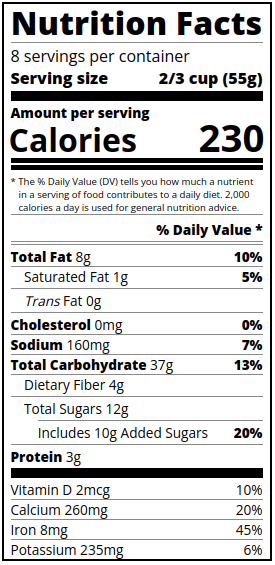

# CSS Typography Nutrition Labels


## Overview

This project demonstrates how to create a **nutrition facts label** using semantic HTML and CSS, with a strong focus on **typography**, **layout**, and **accessibility**. The design replicates the familiar format found on food packaging in the United States and is ideal for learning advanced CSS techniques, especially with fonts, spacing, and responsive layout.



## Features

- **Clean and semantic HTML structure**
- **Responsive and readable typography** using Google Fonts (Open Sans)
- **Realistic nutrition label layout** with precise styling and alignment
- **CSS utility classes** for indentation, boldness, and dividers
- **Fully self-contained**: no JavaScript or external dependencies beyond Google Fonts

## Technologies Used

- HTML5
- CSS3
- Google Fonts: [Open Sans](https://fonts.google.com/specimen/Open+Sans)

## File Structure

```
css-typography-nutrition-labels/
├── images/
│ └── preview.png # Preview image of the nutrition label
├── index.html # Main HTML file
├── styles.css # Stylesheet with typography and layout
├── LICENSE # MIT License
└── README.md # This file
└── .gitignore # what should not be carried
```


## Getting Started

To view the nutrition label in your browser:

1. Clone or download the repository.
2. Open `index.html` in any modern web browser.

```bash
git clone https://github.com/your-username/css-typography-nutrition-labels.git
cd css-typography-nutrition-labels
open index.html  # or double-click in file browser
```

## Design Notes

- The layout uses **flexbox** to align key nutritional values to the right.
- CSS utility classes like `.indent`, `.double-indent`, `.divider`, and `.bold` make the stylesheet modular and reusable.
- Focus was placed on accurate spacing, hierarchy, and font-weight to mirror official nutrition labels.
- The `preview.png` provides a visual reference of the final output.

## License

This project is licensed under the [MIT License](LICENSE).  
Feel free to use, modify, and distribute it as you wish.